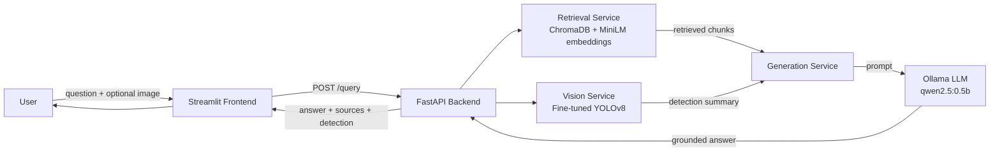

# RAG-Powered Retail Assistant (Extended Track)

A Retrieval-Augmented Generation (RAG) assistant for retail operations, extended with a
YOLO computer-vision component. Ask questions about return policies, shipping, warranties,
and restocking rules — optionally attach a shelf photo, and the assistant will detect
products on the shelf with a fine-tuned YOLOv8 model and factor that into its answer.

Built for the Level 2 Summer Training Graduation Project (Extended Track).

## Overview

- **Domain:** Retail / e-commerce — store policy documents + shelf product detection
- **Text corpus:** 10 retail policy documents (returns, warranties, shipping, restocking, planogram guidelines, loyalty, price matching)
- **Image dataset:** [SKU-110K](https://github.com/eg4000/SKU110K_CVPR19) — 11,762 densely-packed retail shelf images with bounding-box annotations
- **Core pipeline:** chunk → embed → store in ChromaDB → retrieve → prompt a local Ollama LLM → grounded, cited answer
- **Extended pipeline:** fine-tuned YOLOv8 detects products on an uploaded shelf image; the detection summary is injected into the RAG prompt as extra context

## Architecture



## Tech Stack

| Layer | Technology |
|---|---|
| Notebook / experimentation | Jupyter (Kaggle), pandas |
| Chunking & embeddings | `sentence-transformers` (`all-MiniLM-L6-v2`) |
| Vector store | ChromaDB (persisted) |
| Object detection | Ultralytics YOLOv8, fine-tuned on SKU-110K |
| LLM | Ollama (local), `qwen2.5:0.5b` |
| Backend | FastAPI, Pydantic, pytest |
| Frontend | Streamlit |
| Language | Python 3.10+ |

## Project Structure

```
.
├── notebooks/
│   └── rag_pipeline.ipynb        # chunking, embeddings, retrieval, YOLO, evaluation
├── backend/
│   ├── app/
│   │   ├── main.py                # FastAPI app, CORS, startup loading
│   │   ├── api/routes/query.py    # GET /health, POST /query
│   │   ├── core/config.py         # settings from .env
│   │   ├── schemas/query.py       # request/response models
│   │   ├── services/
│   │   │   ├── retrieval.py       # load vector store, retrieve chunks
│   │   │   ├── generation.py      # build prompt, call Ollama
│   │   │   └── vision.py          # load YOLO, run detection
│   │   └── utils/logging_config.py
│   ├── data/vector_store/         # persisted Chroma store (not committed if large)
│   ├── models/yolo_sku110k/       # fine-tuned YOLO weights (best.pt)
│   ├── tests/test_query.py
│   ├── rebuild_vector_store.py    # rebuilds the vector store locally if needed
│   ├── requirements.txt
│   ├── .env.example
│   └── Dockerfile
├── frontend/
│   ├── app.py                     # Streamlit chat UI
│   ├── api_client.py              # backend API wrapper
│   ├── .env
│   └── requirements.txt
├── .gitignore
└── README.md
```

## Data

- **Text corpus:** 10 short retail policy documents, embedded directly in the notebook (`RETAIL_DOCS`) so the pipeline runs standalone with no extra downloads.
- **Image corpus:** [SKU-110K annotations dataset on Kaggle](https://www.kaggle.com/datasets/thedatasith/sku110k-annotations) — includes both images and YOLO-format labels, pre-split into train/val/test. Not committed to this repo due to size; download from the link above and add it to your Kaggle notebook via "Add Data" to reproduce the fine-tuning step.

## Setup

### Prerequisites

- Python 3.10+
- [Ollama](https://ollama.com) installed locally, with a model pulled (this project defaults to `qwen2.5:0.5b` for low memory usage — any Ollama chat model works, just update `OLLAMA_MODEL` in `.env`)
- Git

### Backend

```bash
cd backend
python -m venv .venv
.venv\Scripts\activate      # Windows
# source .venv/bin/activate # macOS/Linux

pip install -r requirements.txt
copy .env.example .env      # Windows
# cp .env.example .env      # macOS/Linux
```

Then place the model artifacts (produced by `notebooks/rag_pipeline.ipynb`, downloaded from Kaggle):
- Unzip the exported vector store into `backend/data/vector_store/`
- Place the fine-tuned YOLO weights at `backend/models/yolo_sku110k/best.pt`

> If the vector store fails to load due to a ChromaDB version mismatch between Kaggle and your local environment, run `python rebuild_vector_store.py` from inside `backend/` to rebuild it locally.

Make sure Ollama is running (`ollama serve`, or the desktop app) and the model in `.env` is pulled (`ollama pull qwen2.5:0.5b`). Then:

```bash
pytest tests/          # should pass without Ollama/vector store/YOLO present (mocked)
uvicorn app.main:app --reload
```

Open `http://localhost:8000/docs` to test `/query` from Swagger UI.

### Frontend

```bash
cd frontend
python -m venv .venv
.venv\Scripts\activate      # Windows
# source .venv/bin/activate # macOS/Linux

pip install -r requirements.txt
streamlit run app.py
```

Opens at `http://localhost:8501`. Make sure the backend is running first, and that `FRONTEND_ORIGIN` in `backend/.env` matches the port Streamlit is running on (default: `8501`).

## Environment Variables

### Backend (`backend/.env`)

| Variable | Description | Default |
|---|---|---|
| `VECTOR_STORE_DIR` | Path to the persisted Chroma store | `data/vector_store` |
| `COLLECTION_NAME` | Chroma collection name | `retail_docs` |
| `EMBEDDING_MODEL` | Sentence-transformers model name | `all-MiniLM-L6-v2` |
| `YOLO_MODEL_PATH` | Path to fine-tuned YOLO weights | `models/yolo_sku110k/best.pt` |
| `YOLO_CONF_THRESHOLD` | Detection confidence threshold | `0.25` |
| `OLLAMA_MODEL` | Ollama model to use for generation | `qwen2.5:0.5b` |
| `OLLAMA_HOST` | Ollama server URL | `http://localhost:11434` |
| `FRONTEND_ORIGIN` | Allowed CORS origin (Streamlit URL) | `http://localhost:8501` |

### Frontend (`frontend/.env`)

| Variable | Description | Default |
|---|---|---|
| `API_BASE_URL` | Backend base URL | `http://localhost:8000` |

## API Reference

### `GET /health`

Returns `200 OK` if the service is up.

```bash
curl http://localhost:8000/health
```

```json
{"status": "ok"}
```

### `POST /query`

Multipart form request. `question` is required; `image` is optional (attach a shelf photo to trigger YOLO detection).

```bash
curl -X POST http://localhost:8000/query \
  -F "question=What is the return policy for electronics?"
```

With an image attached:

```bash
curl -X POST http://localhost:8000/query \
  -F "question=Is this shelf understocked based on the planogram guidelines?" \
  -F "image=@shelf_photo.jpg;type=image/jpeg"
```

**Response:**

```json
{
  "answer": "Electronics may be returned within 30 days of purchase with original packaging and proof of purchase. Opened software and headphones are not eligible for return. [Source: return_policy_electronics.txt]",
  "sources": ["return_policy_electronics.txt", "warranty_electronics.txt"],
  "detection": null
}
```

When an image is attached, `detection` is populated:

```json
{
  "answer": "...",
  "sources": ["planogram_guidelines.txt", "restocking_policy.txt"],
  "detection": {"num_products_detected": 166, "avg_confidence": 0.571}
}
```

## Evaluation Results

YOLOv8 fine-tuned on SKU-110K (5 epochs, val set):

| Metric | Value |
|---|---|
| Precision | 0.871 |
| Recall | 0.797 |
| mAP50 | 0.865 |
| mAP50-95 | 0.506 |

RAG retrieval + generation, tested against 10 sample questions (see `notebooks/rag_pipeline.ipynb`, section 2.6, and `evaluation_results.csv`): retrieval correctly matched the relevant policy document for all 10 test questions. Generation with `qwen2.5:0.5b` produced grounded, source-cited answers; observed failure mode was verbose/templated phrasing rather than hallucination — see the notebook's "Failure cases observed" section for details.

## Demo Video

A recorded walkthrough of the full pipeline (text-only query and an image + text query showing the YOLO detection combined with a grounded RAG answer):

[Demo](https://drive.google.com/file/d/1Sul4wnFChnGOAzd8-Wmz-UIS8MlQClra/view?usp=sharing)

## Notes

- This project uses a small local LLM (`qwen2.5:0.5b`) for low memory footprint; answers may be more verbose or less fluent than a larger model. Swap `OLLAMA_MODEL` in `.env` for a larger model (e.g. `llama3.2:1b`) if more RAM is available.
- The YOLO detection summary (product count, average confidence) is a simple heuristic proxy for shelf status — it is not a direct measurement of "understocked" per the planogram guidelines, which are defined by visible empty-space percentage. The assistant correctly flags this limitation rather than guessing when asked to make that judgment.